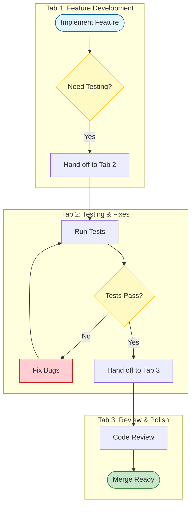

# Claude Code Setup Guide: From Zero to Productive

A comprehensive, beginner-friendly guide to setting up Claude Code for safe, effective AI-assisted development. This guide is based on practices used by the Claude Code team and will help you get the most out of your vibe coding sessions.

---

## Table of Contents

1. [Getting Started](#getting-started)
2. [Terminal Setup](#terminal-setup)
3. [Running Multiple Claudes](#running-multiple-claudes)
4. [Plan Mode: Think Before You Code](#plan-mode-think-before-you-code)
5. [CLAUDE.md: Teaching Claude Your Codebase](#claudemd-teaching-claude-your-codebase)
6. [Slash Commands: Automate Repetitive Tasks](#slash-commands-automate-repetitive-tasks)
7. [Subagents: Specialized AI Assistants](#subagents-specialized-ai-assistants)
8. [Skills: Reusable AI Knowledge](#skills-reusable-ai-knowledge)
9. [Hooks: Automation That Runs During Sessions](#hooks-automation-that-runs-during-sessions)
10. [Permissions: Security Without Friction](#permissions-security-without-friction)
11. [MCP Servers: Connecting Claude to Your Tools](#mcp-servers-connecting-claude-to-your-tools)
12. [Model Selection](#model-selection)
13. [Verification: The Secret to Quality](#verification-the-secret-to-quality)
14. [Quick Reference Cheatsheet](#quick-reference-cheatsheet)

---

## Getting Started

### Installing Claude Code

```bash
# Install Claude Code globally
npm install -g @anthropic-ai/claude-code

# Or with Homebrew (macOS)
brew install claude-code

# Verify installation
claude --version
```

### First Run

```bash
# Start Claude Code in your project directory
cd your-project
claude

# Claude will prompt you to authenticate on first run
```

### Basic Usage

```
> Help me understand this codebase
> Fix the bug in src/auth.ts
> Add a new endpoint for user profiles
```

---

## Terminal Setup

A well-configured terminal makes Claude Code much more pleasant to use.

### Enable Notifications (Never Miss When Claude Finishes)

When running long tasks, you want to know when Claude needs input.

**iTerm 2 (Recommended for macOS)**:

1. Open iTerm 2 Preferences
2. Navigate to **Profiles → Terminal**
3. Enable **"Silence bell"**
4. Under Filter Alerts, enable **"Send escape sequence-generated alerts"**
5. Set your preferred notification delay

Now you'll get a system notification when Claude completes a task.

### Set Up Line Breaks (Shift+Enter)

By default, Enter sends your message. To type multi-line prompts:

**Quick setup**:
```bash
# Run this inside Claude Code
/terminal-setup
```

This automatically configures Shift+Enter for newlines.

**Manual setup for iTerm2/VS Code**:
1. Open Settings → Profiles → Keys
2. Under General, set Left/Right Option key to "Esc+"

**For Mac Terminal.app**:
1. Open Settings → Profiles → Keyboard
2. Check "Use Option as Meta Key"

### Theme Matching

Claude Code can match your terminal's theme:

```
/config
```

Select your theme preference (dark/light) to match your terminal.

### Vim Mode (Optional)

If you prefer Vim keybindings:

```
/vim
```

Supports: mode switching, navigation (hjkl, w/e/b), and basic editing commands.

---

## Running Multiple Claudes

One of the biggest productivity boosts is running multiple Claude instances in parallel.



### Local Terminal Setup

**Recommended**: Run 5 Claude sessions in numbered tabs.

```bash
# Tab 1: Main development
claude

# Tab 2: Bug fixing
claude

# Tab 3: Testing
claude

# Tab 4: Documentation
claude

# Tab 5: Exploration/research
claude
```

**Pro tip**: Number your terminal tabs 1-5 and use system notifications to know which Claude needs attention.

### Claude on the Web

You can also run sessions on [claude.ai/code](https://claude.ai/code):

- **Hand off sessions**: Use `&` to background a local session, then continue on web
- **Teleport**: Use `--teleport` to move sessions between local and web
- **Mobile**: Start sessions from the Claude iOS app and check on them later

### Parallel Workflows

**Example workflow with 3 Claudes**:

| Tab | Task | Status |
|-----|------|--------|
| 1 | Implementing new feature | Active |
| 2 | Running tests and fixing failures | Waiting |
| 3 | Reviewing and refactoring | Background |

Switch between tabs as each Claude completes work or needs input.

---

## Plan Mode: Think Before You Code

**Plan mode is the secret to successful complex tasks.** Instead of diving straight into code, Claude thinks through the approach first.

### Entering Plan Mode

```bash
# Press Shift+Tab twice to enter plan mode
# Or start with:
claude --plan
```

### How to Use Plan Mode

1. **Describe your goal**:
   ```
   I want to add OAuth authentication with Google and GitHub
   ```

2. **Claude creates a plan**: Claude will explore the codebase and propose an implementation approach

3. **Iterate on the plan**: Go back and forth until you're happy with the approach
   ```
   What about handling token refresh?
   Can we use the existing user model instead of creating a new one?
   ```

4. **Execute the plan**: When satisfied, switch to normal mode and Claude executes

### When to Use Plan Mode

**Use Plan Mode for**:
- Features that touch multiple files
- Architectural decisions
- Anything you'd normally sketch on paper first
- Tasks where you're not sure of the approach

**Skip Plan Mode for**:
- Simple bug fixes
- Small, well-defined changes
- Tasks you've done before

### Example Planning Session

```
[Plan Mode]
> Add a caching layer for our API responses

Claude: Let me explore your codebase first...
[Claude searches for existing patterns]

Claude: I found you're using Express with Redis already available.
Here's my proposed approach:
1. Create a cache middleware in src/middleware/cache.ts
2. Add cache keys based on route + query params
3. Set TTL based on endpoint type (5min for lists, 1hr for static)
4. Add cache invalidation on write operations

Do you want me to proceed with this approach, or should we discuss alternatives?

> What about cache invalidation for related resources?

Claude: Good question. I see two options:
1. Tag-based invalidation (more complex, more precise)
2. Time-based expiry only (simpler, might serve stale data)

For your use case, I'd recommend starting with time-based and adding tags later if needed.

> Let's go with option 1 since we have real-time requirements

Claude: Understood. I'll implement tag-based invalidation. Ready to execute?

> Yes, proceed
[Switches to normal mode, implements the plan]
```

---

## CLAUDE.md: Teaching Claude Your Codebase

The `CLAUDE.md` file is Claude's memory of your project. It learns from mistakes and improves over time.

### Creating CLAUDE.md

Create a `CLAUDE.md` file in your repository root:

```markdown
# CLAUDE.md

## Project Overview
This is a Next.js e-commerce application using TypeScript, Prisma, and Stripe.

## Key Commands
- `npm run dev` - Start development server
- `npm test` - Run tests
- `npm run lint` - Run linter
- `npm run build` - Production build

## Architecture
- `/src/app` - Next.js app router pages
- `/src/components` - React components
- `/src/lib` - Shared utilities
- `/src/server` - Server-side code
- `/prisma` - Database schema and migrations

## Code Conventions
- Use functional components with hooks
- Prefer named exports over default exports
- Use Zod for runtime validation
- Always handle loading and error states

## Common Mistakes to Avoid
- Don't use `any` type - use proper TypeScript types
- Don't forget to run `prisma generate` after schema changes
- Don't commit .env files
- Don't use `console.log` in production code - use the logger

## Testing
- Write tests for all new features
- Use React Testing Library for component tests
- Mock external APIs in tests
```

### Team CLAUDE.md

Share `CLAUDE.md` with your team by committing it to git:

```bash
git add CLAUDE.md
git commit -m "Add CLAUDE.md for AI-assisted development"
```

**The whole team contributes**. Whenever Claude makes a mistake:
1. Fix the mistake
2. Add it to CLAUDE.md so it doesn't happen again
3. Commit the update

This creates a compounding knowledge base—mistakes made once are never repeated.

### Updating CLAUDE.md During Code Review

During PR reviews, if you see Claude made a mistake, tag `@claude` to update CLAUDE.md:

```
@claude Please add a note to CLAUDE.md that we should always use the
useQuery hook for data fetching, not fetch() directly.
```

---

## Slash Commands: Automate Repetitive Tasks

Slash commands are reusable prompts for workflows you do frequently.

### Built-in Commands

```bash
/help          # Show help
/config        # Configure settings
/vim           # Toggle vim mode
/terminal-setup # Configure terminal
/permissions   # Manage permissions
/agents        # Manage subagents
```

### Creating Custom Commands

Create `.claude/commands/` in your repo:

```bash
mkdir -p .claude/commands
```

**Example: Commit and PR command** (`.claude/commands/commit-push-pr.md`):

```markdown
---
allowed-tools: Bash(git add:*), Bash(git status:*), Bash(git commit:*), Bash(git push:*), Bash(gh pr:*)
description: Create a commit, push, and open a PR
---

## Context

- Current git status: !`git status`
- Current git diff (staged and unstaged changes): !`git diff HEAD`
- Current branch: !`git branch --show-current`
- Recent commits: !`git log --oneline -10`

## Your Task

Based on the above changes:
1. Stage all relevant changes
2. Create a descriptive commit message
3. Push to the remote branch
4. Create a pull request with a clear description

Ask me for the PR title if the changes are significant.
```

**Usage**:
```
/commit-push-pr
```

### Command Tips

**Pre-compute context with `!` prefix**:
```markdown
- Current branch: !`git branch --show-current`
- Test results: !`npm test 2>&1 | tail -20`
```

The `!` runs the command before the prompt, so Claude has fresh context.

**Specify allowed tools**:
```yaml
---
allowed-tools: Bash(npm test:*), Read, Edit
---
```

This limits which tools the command can use, improving security and focus.

---

## Subagents: Specialized AI Assistants

Subagents are separate Claude instances with specific roles.

### Built-in Subagents

- **Explore**: Fast, read-only codebase exploration
- **Plan**: Research and planning for plan mode
- **General-purpose**: Complex multi-step tasks

### Creating Custom Subagents

Create `.claude/agents/` in your repo:

```bash
mkdir -p .claude/agents
```

**Example: Code Simplifier** (`.claude/agents/code-simplifier.md`):

```markdown
---
name: code-simplifier
description: Simplifies code after Claude is done working. Use proactively after implementing features.
tools: Read, Edit, Bash
model: sonnet
---

Your job is to simplify code that was just written.

Review the recent changes and look for:
1. Unnecessary complexity
2. Code that could be more readable
3. Duplicated logic that could be extracted
4. Overly verbose patterns
5. Unused imports or variables

For each issue found:
- Explain what you're simplifying and why
- Make the change
- Ensure tests still pass after changes

Prefer boring, conventional code over clever abstractions.
```

**Example: Verification Agent** (`.claude/agents/verify-app.md`):

```markdown
---
name: verify-app
description: Comprehensive app verification. Use after completing features to verify everything works.
tools: Bash, Read
model: sonnet
---

Run comprehensive verification:

1. Run the test suite:
   ```bash
   npm test
   ```

2. Run the linter:
   ```bash
   npm run lint
   ```

3. Run type checking:
   ```bash
   npm run type-check
   ```

4. Build the project:
   ```bash
   npm run build
   ```

5. If any step fails, report:
   - Which step failed
   - The exact error message
   - Suggested fix

6. If all steps pass, report success with a summary.
```

### Using Subagents

Claude uses subagents automatically when appropriate, or you can invoke explicitly:

```
> Use the code-simplifier subagent to clean up the code I just wrote
> Have verify-app check that everything works
```

### Managing Subagents

```
/agents
```

This opens an interactive menu to view, create, edit, and delete subagents.

---

## Skills: Reusable AI Knowledge

Skills teach Claude how to do specific things in your project.

### Creating Skills

Create `~/.claude/skills/` for personal skills or `.claude/skills/` for project skills:

```bash
mkdir -p .claude/skills/my-skill
```

**Example: Database Query Skill** (`.claude/skills/database-queries/SKILL.md`):

```yaml
---
name: database-queries
description: Writing database queries for our PostgreSQL database with Prisma. Use when writing queries, database operations, or data migrations.
---

## Database Schema

We use Prisma with PostgreSQL. Key models:
- User: id, email, name, createdAt
- Order: id, userId, status, total, createdAt
- Product: id, name, price, inventory

## Query Patterns

### Finding records
Use `findUnique` for single records by ID:
```typescript
const user = await prisma.user.findUnique({ where: { id } });
```

### Filtering
Use `findMany` with where clauses:
```typescript
const orders = await prisma.order.findMany({
  where: { userId, status: 'PENDING' },
  orderBy: { createdAt: 'desc' },
});
```

### Relations
Always include related data explicitly:
```typescript
const orderWithItems = await prisma.order.findUnique({
  where: { id },
  include: { items: { include: { product: true } } },
});
```

## Common Mistakes
- Don't use raw SQL unless absolutely necessary
- Always handle null returns from findUnique
- Use transactions for multi-step operations
```

### Skills vs Commands vs Subagents

| Feature | Use When |
|---------|----------|
| **Skills** | Teaching Claude knowledge (patterns, conventions, APIs) |
| **Commands** | Automating a workflow you run frequently |
| **Subagents** | Delegating a task to a separate context |

---

## Hooks: Automation That Runs During Sessions

Hooks run scripts automatically at specific points in your Claude session.

### PostToolUse: Auto-Format Code

The most useful hook: auto-format code after every edit.

Create `.claude/settings.json`:

```json
{
  "hooks": {
    "PostToolUse": [
      {
        "matcher": "Write|Edit",
        "hooks": [
          {
            "type": "command",
            "command": "npm run format || true"
          }
        ]
      }
    ]
  }
}
```

**Language-specific formatting**:

| Language | Command |
|----------|---------|
| JavaScript/TypeScript | `prettier --write .` |
| Python | `black . && isort .` |
| Go | `gofmt -w .` |
| Rust | `cargo fmt` |

**Why `|| true`?** This prevents the hook from blocking Claude if formatting fails on a partial file.

### Stop Hooks: Verify Before Finishing

Run verification when Claude completes a task:

```json
{
  "hooks": {
    "Stop": [
      {
        "type": "command",
        "command": "npm test"
      }
    ]
  }
}
```

### Notification Hooks

Get notified when Claude finishes:

```json
{
  "hooks": {
    "Stop": [
      {
        "type": "command",
        "command": "osascript -e 'display notification \"Claude finished!\" with title \"Claude Code\"'"
      }
    ]
  }
}
```

---

## Permissions: Security Without Friction

Instead of using `--dangerously-skip-permissions`, pre-allow safe commands.

### Configuring Permissions

Use `/permissions` to manage, or edit `.claude/settings.json`:

```json
{
  "permissions": {
    "allow": [
      "Bash(npm test:*)",
      "Bash(npm run lint:*)",
      "Bash(npm run build:*)",
      "Bash(npm run format:*)",
      "Bash(git status:*)",
      "Bash(git diff:*)",
      "Bash(git log:*)",
      "Bash(git branch:*)",
      "Bash(git add:*)",
      "Bash(git commit:*)",
      "Read(*)",
      "Glob(*)",
      "Grep(*)"
    ]
  }
}
```

### Team Permissions

Commit `.claude/settings.json` to share safe permissions with your team.

### Permission Patterns

| Pattern | What It Allows |
|---------|----------------|
| `Bash(npm test:*)` | Any npm test command |
| `Bash(git:*)` | Any git command |
| `Read(*)` | Read any file |
| `Edit(src/**)` | Edit files in src/ |

---

## MCP Servers: Connecting Claude to Your Tools

MCP (Model Context Protocol) servers let Claude interact with external tools.

### Common MCP Servers

**Slack** - Let Claude search and post to Slack:
```json
{
  "mcpServers": {
    "slack": {
      "command": "npx",
      "args": ["-y", "@anthropic/mcp-server-slack"],
      "env": {
        "SLACK_TOKEN": "${SLACK_TOKEN}"
      }
    }
  }
}
```

**PostgreSQL** - Direct database access:
```json
{
  "mcpServers": {
    "postgres": {
      "command": "npx",
      "args": ["-y", "@anthropic/mcp-server-postgres"],
      "env": {
        "DATABASE_URL": "${DATABASE_URL}"
      }
    }
  }
}
```

**Filesystem** - Enhanced file operations:
```json
{
  "mcpServers": {
    "filesystem": {
      "command": "npx",
      "args": ["-y", "@anthropic/mcp-server-filesystem", "/path/to/allowed/directory"]
    }
  }
}
```

### Team MCP Configuration

Share MCP configs by creating `.mcp.json` in your repo:

```json
{
  "mcpServers": {
    "slack": {
      "command": "npx",
      "args": ["-y", "@anthropic/mcp-server-slack"]
    }
  }
}
```

Team members set their own tokens in environment variables.

---

## Model Selection

### Choosing the Right Model

| Model | Best For | Trade-offs |
|-------|----------|------------|
| **Opus 4.5** | Complex coding, architecture, best quality | Slower, more expensive |
| **Sonnet** | Balanced speed/quality, most tasks | Good default |
| **Haiku** | Quick tasks, exploration, simple fixes | Less capable |

### Recommended Approach

**Use Opus 4.5 with thinking for everything important.**

It's bigger and slower than Sonnet, but:
- You steer it less (fewer iterations)
- Better at tool use (fewer mistakes)
- Almost always faster overall (less back-and-forth)

```bash
# Use Opus with extended thinking
claude --model opus
```

### Subagent Models

Different subagents can use different models:

```markdown
---
name: quick-search
model: haiku  # Fast for exploration
---
```

```markdown
---
name: code-reviewer
model: opus  # Best quality for reviews
---
```

---

## Verification: The Secret to Quality

**The single most important thing for getting great results: give Claude a way to verify its work.**

If Claude has a feedback loop, it will 2-3x the quality of the final result.

### Simple Verification

Tell Claude to test its work:

```
After implementing this feature:
1. Run `npm test`
2. Run `npm run lint`
3. Run `npm run build`

Fix any failures before reporting completion.
```

### Automated Verification (Stop Hook)

```json
{
  "hooks": {
    "Stop": [
      {
        "type": "command",
        "command": "npm test && npm run lint && npm run build"
      }
    ]
  }
}
```

### Verification Subagent

For complex verification, create a dedicated subagent:

```markdown
---
name: verify
description: Run comprehensive verification. Use after completing features.
tools: Bash, Read
---

Run all verification steps:
1. `npm test` - All tests must pass
2. `npm run lint` - No linting errors
3. `npm run type-check` - No type errors
4. `npm run build` - Build must succeed

Report failures with specific errors and suggested fixes.
```

Usage:
```
After you finish, use the verify subagent to check everything works.
```

### Browser Verification

For frontend work, Claude can test in a real browser using the Claude Chrome extension:

```
After implementing this UI change:
1. Open the app in Chrome
2. Navigate to the page
3. Test the feature visually
4. Iterate until it works correctly
```

### Domain-Specific Verification

| Domain | Verification |
|--------|-------------|
| Backend API | Test suite + curl requests |
| Frontend UI | Browser testing |
| CLI tools | Run commands, check output |
| Libraries | Unit tests + example usage |

---

## Quick Reference Cheatsheet

### Essential Commands

| Command | Purpose |
|---------|---------|
| `/help` | Show help |
| `/config` | Configure settings |
| `/permissions` | Manage permissions |
| `/agents` | Manage subagents |
| `/terminal-setup` | Configure terminal |
| `Shift+Tab` (×2) | Toggle plan mode |

### Essential Files

| File | Purpose |
|------|---------|
| `CLAUDE.md` | Project knowledge for Claude |
| `.claude/settings.json` | Permissions, hooks |
| `.claude/commands/` | Slash commands |
| `.claude/agents/` | Subagents |
| `.claude/skills/` | Project skills |
| `~/.claude/skills/` | Personal skills |
| `.mcp.json` | MCP server configs |

### Quick Setup (Do These First)

1. **Terminal**: Run `/terminal-setup` for Shift+Enter
2. **Create CLAUDE.md**: Add project overview and conventions
3. **Add formatting hook**: Auto-format on save
4. **Set permissions**: Pre-allow safe commands
5. **Verification**: Tell Claude to test after changes

### Advanced Setup (Add As Needed)

1. Create custom slash commands for repeated workflows
2. Create subagents for specialized tasks
3. Add MCP servers for external tools
4. Configure Stop hooks for automatic verification
5. Create skills for domain-specific knowledge

---

## Next Steps

1. **Start simple**: Just install Claude Code and start using it
2. **Add CLAUDE.md**: Teach Claude about your project
3. **Set up formatting**: Add a PostToolUse hook
4. **Create your first command**: Automate something you do daily
5. **Experiment with Plan mode**: Use it for your next feature

Remember: **There's no one correct way to use Claude Code.** Start vanilla and customize as you find friction points. The Claude Code team each use it very differently—find what works for you.
