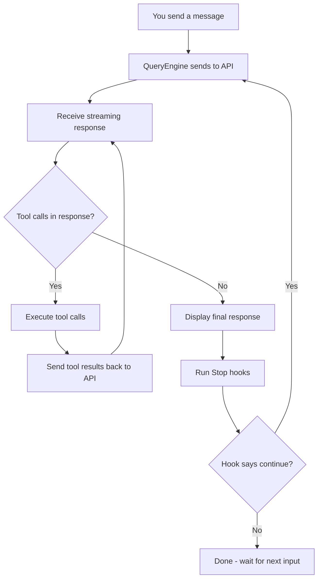
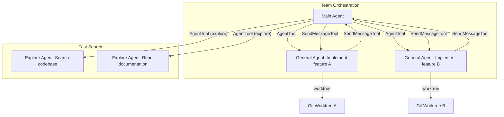

# Claude Code Architecture Deep Dive

Claude Code is built on ~1,900 TypeScript files totaling over 512K lines of code, running on the Bun runtime with a React+Ink terminal UI. Understanding how it works internally changes how you write prompts, configure hooks, and design MCP integrations. This guide maps the internals to practical decisions.

> **Prerequisite reading:** [Beginner Setup](./BEGINNER_SETUP.md) covers basic Claude Code configuration. [Context Management](./CONTEXT_MANAGEMENT.md) covers session strategy. Read those first if you're new.

---

## Table of Contents

1. [How Claude Code Processes Your Input](#1-how-claude-code-processes-your-input-the-queryengine)
2. [The Tool System Architecture](#2-the-tool-system-architecture)
3. [Deferred Tool Loading](#3-deferred-tool-loading-toolsearch)
4. [The Skill System Internals](#4-the-skill-system-internals)
5. [Multi-Agent Architecture](#5-multi-agent-architecture)
6. [Context Management Internals](#6-context-management-internals)
7. [The Hook System](#7-the-hook-system)
8. [IDE Bridge Architecture](#8-ide-bridge-architecture)
9. [Performance Optimization Patterns](#9-performance-optimization-patterns)
10. [What This Means for Your Workflow](#10-what-this-means-for-your-workflow)

---

## 1. How Claude Code Processes Your Input (The QueryEngine)

The core of Claude Code is the QueryEngine — roughly 46K lines of TypeScript handling streaming, tool-call chaining, retry logic, and thinking mode. Every message you send enters the same loop:



This loop is why verification workflows work so well. Claude can chain operations in a single turn:

1. Write code (FileWriteTool)
2. Run tests (BashTool)
3. Read error output
4. Fix the code (FileEditTool)
5. Run tests again (BashTool)
6. Repeat until passing

**Thinking mode** adds a separate reasoning step before each response. When you use Opus with extended thinking enabled, Claude reasons through the problem before deciding what to do next. This is why thinking mode produces better results on complex tasks — it plans before it acts, every iteration of the loop.

### Practical Implications

- **Design prompts as workflows, not instructions.** Instead of "write a function that does X," say "write a function that does X, then run the tests, then fix any failures." The QueryEngine will chain these naturally.
- **Don't micro-manage the loop.** You don't need to say "if the tests fail, try again." Claude already does this when the task implies verification.
- **Long chains are normal.** A single prompt can trigger 20+ tool calls. This is by design.

---

## 2. The Tool System Architecture

Claude Code ships with roughly 40 built-in tools. Each tool follows the same pattern:

- **Zod-validated input schema** — inputs are validated before execution
- **Permission model** — determines whether user approval is needed
- **Execution logic** — the actual implementation

### Key Tool Categories

| Category | Tools | Notes |
|----------|-------|-------|
| File operations | FileReadTool, FileWriteTool, FileEditTool | Edit sends diffs, not full files |
| Search | GlobTool, GrepTool (ripgrep-based) | Grep is fast on large codebases |
| Execution | BashTool | Runs in subprocess, configurable timeout |
| Navigation | AgentTool | Spawns sub-agents (see section 5) |
| Web | WebFetchTool, WebSearchTool | Fetch retrieves URLs, Search queries the web |
| Integration | MCPTool, SkillTool | External tool servers and packaged knowledge |
| Notebook | NotebookEditTool | Jupyter notebook cell operations |
| Meta | ToolSearchTool, SleepTool, EnterPlanModeTool | System-level tools |

Every tool validates its input via Zod before execution. If Claude generates malformed input (wrong types, missing required fields), it gets caught and reported back — Claude then corrects and retries. This is another reason the loop architecture matters.

### Practical Implications

When writing CLAUDE.md rules, you are constraining which tools Claude selects. Be specific:

```markdown
# CLAUDE.md - Tool constraints

## File editing
- Always use FileEditTool instead of FileWriteTool for modifying existing files
- Never use BashTool with sed/awk for file modifications

## Testing
- Run tests via BashTool with `npm test` after every file change
- Never use BashTool to run `rm -rf` on any directory
```

These rules work because Claude maps them directly to tool selection decisions in the loop.

---

## 3. Deferred Tool Loading (ToolSearch)

Not all tool schemas are loaded when a conversation starts. Some tools are "deferred" — only their names are known initially. When Claude needs a deferred tool, it calls ToolSearchTool to fetch the full schema on demand.

This matters for token economics. Every tool schema that's loaded costs tokens on every turn. A tool with a complex input schema might cost 200-500 tokens per turn just by existing in the context.

### How It Works

1. At session start, Claude sees a list of deferred tool names (no schemas)
2. When a task requires a deferred tool, Claude calls ToolSearch with a query
3. ToolSearch returns the full schema, making the tool callable
4. The tool remains available for the rest of the session

This is the same principle behind MCP tool grouping. The difference: ToolSearch is built into Claude Code for its own tools, while MCP tool grouping is something you implement on your servers.

### Practical Implications for MCP Developers

Your MCP tool schemas cost tokens on every turn. This adds up:

```
10 tools x 150 tokens/schema x 50 turns = 75,000 tokens wasted

With grouping:
3 active tools x 150 tokens x 50 turns = 22,500 tokens
Savings: 70%
```

Keep tool descriptions concise. Don't write paragraphs in your schema descriptions — write one clear sentence. See [MCP Tool Grouping](./MCP_TOOL_GROUPING.md) for implementation patterns.

---

## 4. The Skill System Internals

Skills are packaged knowledge stored as markdown files. They live in two locations:

- **Project skills:** `.claude/skills/` in your repo
- **Personal skills:** `~/.claude/skills/` in your home directory

### Skill Structure

Each skill has a `SKILL.md` file with frontmatter and body:

```markdown
---
name: React Component Generator
description: "Generate React components with TypeScript, tests, and Storybook stories"
trigger: "react component, new component, create component"
---

# React Component Generator

When creating a new React component, follow these patterns:

## File Structure
- `src/components/{ComponentName}/{ComponentName}.tsx` - Component
- `src/components/{ComponentName}/{ComponentName}.test.tsx` - Tests
- `src/components/{ComponentName}/{ComponentName}.stories.tsx` - Storybook
- `src/components/{ComponentName}/index.ts` - Barrel export

## Component Template
Always use functional components with explicit prop types:
...
```

Skills are matched based on description keywords. When you type something that matches the trigger or description, Claude loads the skill via SkillTool, injecting its content into the conversation.

### Practical Implications

- **Write descriptions that match natural language.** The trigger `"react component, new component, create component"` matches how developers actually talk.
- **Skills work best for patterns and constraints**, not step-by-step procedures. Put reusable patterns, coding standards, and architectural rules in skills. Use slash commands for procedures.
- **Keep skills focused.** A 200-line skill that covers everything about React is worse than three 60-line skills covering components, hooks, and state management separately.

---

## 5. Multi-Agent Architecture

AgentTool spawns sub-agents — independent Claude instances with their own context window and tool access. This is how Claude Code handles tasks that are too large or too parallel for a single agent.



### Built-in Agent Types

| Agent Type | Tool Access | Best For |
|-----------|-------------|----------|
| General-purpose | Full tool access | Complex implementation tasks |
| Explore | Read-only, fast | Searching, reading, understanding code |
| Plan | Research and planning | Architecture decisions, investigation |

### Custom Agents

Define custom agents in `.claude/agents/`:

```markdown
---
name: Security Reviewer
model: claude-sonnet-4-20250514
tools:
  - GrepTool
  - GlobTool
  - FileReadTool
  - BashTool
---

# Security Reviewer

You are a security-focused code reviewer. Your job is to:
1. Search for common vulnerability patterns (SQL injection, XSS, CSRF, etc.)
2. Check dependency versions against known CVE databases
3. Verify that authentication and authorization are properly implemented
4. Report findings in a structured format

Never modify files. Only read and report.
```

### Coordination and Isolation

- **SendMessageTool** enables inter-agent messaging — agents can request help, share findings, or coordinate work
- **TeamCreateTool/TeamDeleteTool** spin up teams of agents for parallel execution
- **teamMemorySync** synchronizes learned knowledge across team members
- **Worktree isolation** lets agents work in temporary git worktrees, preventing them from stepping on each other's changes

### Practical Implications

- **Use Explore agents for search.** They're faster and cheaper than general-purpose agents. When you need to understand a codebase, an Explore agent reads everything and reports back.
- **Use worktrees for risky parallel work.** Two agents editing the same file without worktrees will create conflicts. Worktrees give each agent its own working directory.
- **Custom agents enforce constraints.** A security reviewer agent that can only read files can't accidentally introduce vulnerabilities. Constrain tools to match the agent's role.

---

## 6. Context Management Internals

Claude Code manages several layers of context that are assembled before each API call.

### Context Assembly Order

1. **System context** — OS, shell, working directory, git state
2. **User context** — CLAUDE.md content, settings, permissions
3. **Skill context** — any matched skills injected via SkillTool
4. **Memory context** — persisted memories from `~/.claude/memory/`
5. **Conversation history** — previous messages and tool results
6. **MCP tool schemas** — schemas for all active MCP tools

### The Compact Service

When conversations grow long, the compact service compresses history while preserving key information. It identifies which parts of the conversation are still relevant and summarizes the rest.

### The Memory System

The `extractMemories` service automatically identifies important information from conversations:
- Architectural decisions
- User preferences (coding style, tool preferences)
- Project-specific patterns
- Error resolutions that took multiple attempts

These memories persist in `~/.claude/memory/` (organized in a `memdir/` structure) and are loaded into future sessions. This reduces cold-start time — Claude doesn't need to re-discover your project's conventions every session.

### Token Estimation

The token estimation service predicts context usage before making API calls. This is how Claude Code knows when you're approaching the context limit and need to compact.

### Practical Implications

- **CLAUDE.md content is included every turn.** A 2,000-token CLAUDE.md costs 2,000 tokens per turn over a 50-turn session — that's 100K tokens. Keep it lean and focused.
- **Use `/compact` proactively.** Don't wait for context to overflow. Compact when the conversation has covered multiple topics and you're starting a new task.
- **Memories reduce repetition.** If you find yourself re-explaining project conventions every session, check that the memory system is capturing them. You can also manually add memories.

```markdown
# CLAUDE.md - Keep this lean

## Project: my-app
- TypeScript + React + Vite
- Tests: Vitest, run with `npm test`
- Lint: `npm run lint` (ESLint + Prettier)

## Conventions
- Functional components only
- Use React Query for server state
- Use Zustand for client state
- All new files need tests

## Do NOT
- Use `any` type
- Skip tests
- Use class components
```

This is about 100 tokens. It tells Claude everything essential without wasting context.

---

## 7. The Hook System

Hooks execute shell commands at specific lifecycle points. They're your automation layer — running formatters, linters, tests, and custom scripts in response to what Claude does.

### Lifecycle Points

| Hook | When It Fires | Receives |
|------|--------------|----------|
| `PreToolUse` | Before a tool executes | Tool name, input parameters |
| `PostToolUse` | After a tool executes | Tool name, input parameters, output |
| `Stop` | When Claude finishes a response | Full response content |
| `Notification` | When Claude sends a notification | Notification content |

### Hook Configuration

Hooks are configured in `.claude/settings.json` or `~/.claude/settings.json`:

```json
{
  "hooks": {
    "PostToolUse": [
      {
        "match": "Write|Edit",
        "command": "prettier --write \"$CLAUDE_FILE_PATH\" 2>/dev/null || true"
      },
      {
        "match": "Bash",
        "command": "if echo \"$CLAUDE_TOOL_INPUT\" | grep -q 'git commit'; then npm run lint || true; fi"
      }
    ],
    "Stop": [
      {
        "command": "npm test 2>&1 | tail -20"
      }
    ]
  }
}
```

### How Hooks Interact with the Loop

This is the critical detail: **Stop hooks can feed results back into the QueryEngine loop.** When a Stop hook runs and produces output, Claude sees that output and can decide to continue working. This is how you automate verification:

1. Claude finishes writing code
2. Stop hook runs `npm test`
3. Test output (including failures) feeds back to Claude
4. Claude sees failures and re-enters the loop to fix them
5. Repeat until tests pass

### Hook Patterns

**Format on save:**
```json
{
  "PostToolUse": [
    {
      "match": "Write|Edit",
      "command": "prettier --write \"$CLAUDE_FILE_PATH\" 2>/dev/null || true"
    }
  ]
}
```

**Test after every response:**
```json
{
  "Stop": [
    {
      "command": "cd /path/to/project && npm test 2>&1 | tail -30"
    }
  ]
}
```

**Lint before commit:**
```json
{
  "PostToolUse": [
    {
      "match": "Bash",
      "command": "if echo \"$CLAUDE_TOOL_INPUT\" | grep -q 'git commit'; then npm run lint; fi"
    }
  ]
}
```

### Practical Implications

- **Hooks and permissions are separate systems.** Hooks execute after permission is granted. A hook can't block a tool call that's already been permitted — it runs after the fact.
- **Use `|| true` for non-blocking hooks.** A failing PostToolUse hook doesn't need to stop everything. Format failures are informational; test failures in Stop hooks are actionable.
- **Stop hooks are your most powerful tool.** They turn Claude Code from "do what I say" into "do what I say and verify it works." Use them.
- **Keep hooks fast.** A hook that takes 10 seconds runs on every relevant tool call. That adds up. Run targeted checks, not full test suites, in PostToolUse hooks. Save comprehensive tests for Stop hooks.

---

## 8. IDE Bridge Architecture

Claude Code integrates with VS Code and JetBrains through a bidirectional bridge. This isn't a thin wrapper — it's a full communication layer.

### How the Bridge Works

- **JWT authentication** secures communication between Claude Code and the IDE
- **Permission prompts** are forwarded to the IDE when running in bridge mode — you approve tool calls in your editor, not the terminal
- **REPL sessions** can be managed through the bridge, keeping everything in one window
- **Session state** (context, memories, tool permissions) is shared between terminal and IDE instances

### What This Means in Practice

The same CLAUDE.md, hooks, and permissions work in both terminal and IDE. You configure once and use everywhere. A hook that formats files after writes works identically whether you're in the terminal or VS Code.

The bridge also means that IDE-specific context (open files, cursor position, selected text) can inform Claude's responses. When you select code in VS Code and invoke Claude, it knows exactly what you're looking at.

---

## 9. Performance Optimization Patterns

Claude Code is engineered for fast startup and low overhead. Understanding these patterns helps you avoid accidentally degrading performance.

### Startup Optimizations

- **Parallel prefetch:** System settings and keychain reads start before module initialization completes
- **Lazy loading:** Heavy dependencies are loaded on-demand, not at startup
  - OpenTelemetry: ~400KB, loaded only when tracing is enabled
  - gRPC: ~700KB, loaded only when needed for communication
- **Commander.js** handles CLI parsing with parallelized startup paths

### Feature Flags

Bun's dead-code elimination removes unused features at build time:

- `VOICE_MODE` — voice input/output
- `DAEMON` — background daemon process
- `AGENT_TRIGGERS` — event-driven agent activation
- `MONITOR_TOOL` — system monitoring capabilities
- `PROACTIVE` — proactive suggestions
- `KAIROS` — temporal reasoning features
- `BRIDGE_MODE` — IDE integration

Disabled features add zero overhead. They're eliminated from the bundle entirely.

### Practical Implications

- **Your MCP servers should start fast.** Claude Code waits for MCP servers to initialize before a session is ready. A server that takes 5 seconds to start delays every session by 5 seconds. Use lazy initialization in your MCP servers.
- **Hooks should be lightweight.** A PostToolUse hook runs on every matching tool call. If your hook spawns a heavy process, consider caching or running conditionally.
- **Don't fight the lazy loading.** If a tool seems missing at session start, it's probably deferred. Use ToolSearch or just ask for what you need — Claude handles the loading automatically.

---

## 10. What This Means for Your Workflow

Here are the key takeaways, distilled into actionable rules:

### Write CLAUDE.md rules that target the tool system

Be specific about tool names and patterns. "Don't use sed" is vague. "Never use BashTool with sed or awk for file modifications — use FileEditTool instead" maps directly to how Claude selects tools.

### Design hooks that leverage lifecycle points

Don't just use Stop hooks. PostToolUse hooks give you real-time feedback on every file write, every bash command, every tool invocation. Use them for formatting, linting, and validation. Save Stop hooks for comprehensive verification.

### Use the right agent type for the right task

| Task | Agent Type | Why |
|------|-----------|-----|
| "Find all uses of this function" | Explore | Fast, read-only, cheap |
| "Design the architecture for feature X" | Plan | Research-focused, thorough |
| "Implement feature X" | General-purpose | Full tool access |
| "Check for security issues" | Custom (read-only) | Constrained, safe |

### Keep context lean

- CLAUDE.md: under 200 tokens for essential rules
- Use `/compact` when switching tasks
- Leverage deferred tool loading in MCP (don't expose all tools at once)
- Let the memory system handle session-to-session knowledge transfer

### Trust the verification loop

Claude's QueryEngine is designed to chain tool calls until the task is complete. You don't need to say "if this fails, try again." Just describe the desired end state and the verification method:

> "Write the migration, run it against the test database, and make sure all existing tests still pass."

Claude will loop through write → execute → test → fix → test until it's done.

### Use worktree isolation for risky operations

When running multiple agents on parallel tasks, or when an agent is doing something risky (large refactors, database migrations), use worktree isolation. Each agent gets its own copy of the codebase. Merge the results when everything passes.

---

## Related Guides

- [Beginner Setup](./BEGINNER_SETUP.md) — Getting started with Claude Code configuration
- [Context Management](./CONTEXT_MANAGEMENT.md) — Strategies for managing context across sessions
- [MCP Tool Grouping](./MCP_TOOL_GROUPING.md) — Reducing token cost when your MCP server grows
- [MCP Development](./MCP_DEVELOPMENT.md) — Building MCP servers from scratch
- [Team Workflows](./TEAM_WORKFLOWS.md) — Multi-person workflows with Claude Code
