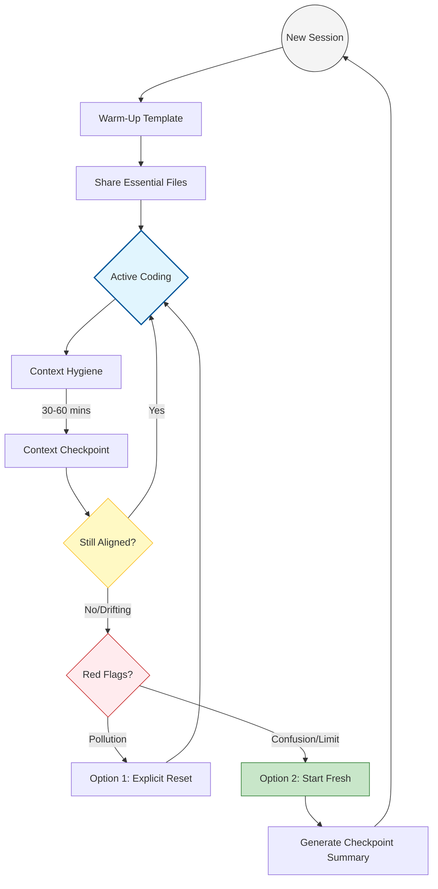
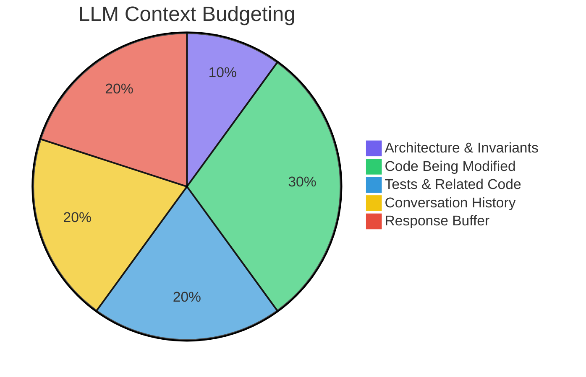
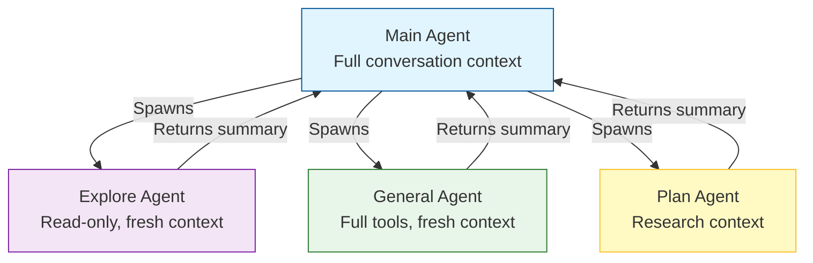

# Context Management: Working with LLMs Across Sessions

One of the biggest challenges in AI-assisted development is maintaining coherent context across long projects and multiple sessions. LLMs have no memory between conversations, and even within a conversation, context can become polluted or confused.

This document provides strategies for effective context management.

---

## The Context Problem

**Challenge**: LLMs need context to produce correct code, but:
- Context windows have limits (~100k-200k tokens)
- Context can become polluted with outdated information
- Long conversations drift from original goals
- New sessions start with zero knowledge

**Solution**: Treat context as a precious resource. Provide it intentionally and maintain it carefully.

---

## Context Management Lifecycle

Use this flow to maintain a "high-value" context budget throughout your development cycle.



---

## Starting a New Session

### Warm-Up Template

When starting a new LLM session on an existing project, provide this context upfront:

```
I'm working on [PROJECT_NAME], a [TYPE] that [PURPOSE].

Key context:
- Architecture: [Brief summary or link to ARCHITECTURE.md]
- Current phase: [Which roadmap phase you're in]
- Recent work: [What was done in last session]
- Today's goal: [What you're trying to accomplish]

Critical constraints:
- [Key invariants from INVARIANTS.md]
- [Technology stack]
- [Any recent architectural decisions]

Please confirm you understand the context before we begin.
```

### Essential Files to Share

**Always provide**:
- `ARCHITECTURE.md` (or relevant sections)
- `INVARIANTS.md`
- README (for setup/context)

**Provide as needed**:
- Recent checkpoint summaries
- Specific files you'll be working with
- Related test files
- Recent commit messages for context

**Don't dump everything**: Selective context is better than overwhelming the LLM.

---

## During a Session: Maintaining Context

### Context Hygiene Practices

**Do**:
- ✅ Reference back to invariants and architecture docs
- ✅ Remind the LLM of decisions made earlier in the session
- ✅ Correct misconceptions immediately
- ✅ Summarize progress periodically
- ✅ Keep conversations focused on one feature/task

**Don't**:
- ❌ Let the conversation drift to unrelated topics
- ❌ Assume the LLM remembers earlier context perfectly
- ❌ Work on multiple unrelated features in one session
- ❌ Continue when the LLM seems confused

### When to Start a Fresh Conversation

**Start fresh when**:
- The LLM is consistently misunderstanding requirements
- You've been working for 2+ hours on complex changes
- Switching to a completely different part of the codebase
- Previous suggestions were mostly wrong (context is polluted)
- You've hit the context window limit
- The conversation has >50 back-and-forth exchanges

**Before starting fresh**:
- Generate a checkpoint summary of what you accomplished
- Document any decisions made
- Commit working code
- Note any issues or blockers

### Context Checkpoints

Every 30-60 minutes, or after completing a subtask:

```
Let's pause and summarize:
- What have we accomplished so far?
- What assumptions have we made?
- What's still left to do?
- Are we still aligned with the architecture and invariants?
```

This prevents context drift and catches misalignments early.

---

## Managing Context Window Limits

### Signs You're Hitting Limits

- LLM responses become generic or vague
- It "forgets" earlier decisions
- Responses take longer to generate
- Quality degrades over time

### Strategies to Extend Effective Context

**1. Be Selective**
- Don't paste entire files if you only need a function
- Provide relevant snippets, not everything
- Link to full files instead of including them

**2. Use Summaries**
- Summarize previous work instead of re-sharing all code
- Reference "as discussed earlier" instead of repeating

**3. Progressive Disclosure**
- Start with high-level context
- Drill down into specifics only as needed
- Don't front-load everything

**4. Anchor Points**
- Keep architecture docs and invariants as "north star" references
- These should be re-readable without consuming too much context

**5. Session Splitting**
- Break large tasks into smaller sessions
- Each session focuses on one module or feature
- Use checkpoint summaries to bridge sessions



### Claude Code's Built-in Context Tools

Claude Code provides built-in tools for managing context that align with the strategies above:

**`/compact` — Context Compression**

The `/compact` command triggers Claude Code's internal compression service, which summarizes conversation history while preserving key decisions, code changes, and context. Use it when:

- You notice response quality degrading
- The conversation has gone on for 30+ exchanges
- You're about to switch to a different part of the codebase
- Claude starts "forgetting" earlier decisions

```
> /compact
Claude compresses the conversation, preserving key context while reclaiming token space.
```

**Pro tip**: You can provide a focus hint: `/compact focus on the auth module changes` to guide what gets preserved during compression.

**`/memory` — Persistent Memory Across Sessions**

Claude Code automatically extracts important information from your conversations and stores it in `~/.claude/memory/`. This means Claude remembers project-specific knowledge across sessions without you re-explaining it.

View and manage memories:
```
> /memory
Shows all stored memories for the current project and globally.
```

Memories bridge the gap between sessions. Instead of starting from zero, Claude loads relevant memories from previous work — reducing the warm-up template needed.

**How memories interact with CLAUDE.md**: CLAUDE.md provides *explicit, structured* project knowledge. Memories provide *learned, organic* knowledge from past sessions. Together they form a comprehensive context baseline for each conversation.

**`/cost` — Token Budget Awareness**

```
> /cost
Shows token usage and estimated cost for the current session.
```

Use this to monitor how much context you're consuming. If costs seem high, it's a signal that context is bloated — consider `/compact` or starting a fresh session.

---

## Context Pollution: Prevention & Recovery

### How Context Gets Polluted

- Exploring dead-end approaches
- LLM misunderstanding a requirement and building on that
- Mixing multiple unrelated tasks
- Outdated information from early in conversation
- Conflicting instructions

### Preventing Pollution

**At the start**:
- Clear, focused goal for the session
- Explicit constraints upfront
- Reference to authoritative docs (architecture, invariants)

**During the session**:
- Correct misconceptions immediately (don't let them compound)
- Explicitly mark dead-ends: "Let's discard that approach"
- Stay focused on one task/feature

**If pollution occurs**:
- **Option 1**: Explicitly reset
  ```
  Let's reset. Ignore previous approaches we discussed.
  Here's the correct approach: [...]
  ```

- **Option 2**: Start fresh conversation
  - Summarize what worked
  - Note what didn't work (so new session avoids it)
  - Begin new session with clean context

---

## Working Across Multiple Sessions

### Session Continuity Pattern

**End of Session**:
1. Generate checkpoint summary
2. Commit working code
3. Document any blockers or open questions
4. Note what's next

**Start of Next Session**:
1. Review checkpoint summary
2. Provide warm-up context (see template above)
3. Explicitly state: "We're continuing from where we left off"
4. Share only relevant new context

### The Handoff Document

For complex work spanning many sessions, maintain a `WORKING_NOTES.md`:

```markdown
## Current Work: User Authentication Feature

### Status
- ✅ OAuth integration complete
- ✅ Token validation working
- 🚧 In progress: Session management
- ⏳ Not started: Logout flow

### Context for Next Session
- Using JWT for sessions
- Tokens expire in 1 hour
- Refresh tokens stored in Redis
- Need to implement token refresh logic next

### Decisions Made
- Chose JWT over sessions (stateless)
- Redis for refresh token storage (fast, expire support)
- 1-hour token lifetime (balance security/UX)

### Blockers
- None currently

### Files Changed
- src/auth/oauth.ts
- src/auth/token.ts
- src/middleware/auth.ts
```

This makes resuming work trivial, even days later.

---

## Multi-LLM Context Management

If using multiple LLM conversations in parallel (e.g., one for backend, one for frontend):

**Synchronization points**:
- Shared architecture document
- Shared invariants
- API contracts document
- Regular manual sync of decisions

**Dangers**:
- Conversations making conflicting assumptions
- Duplicated effort
- Integration issues at boundaries

**Best practice**: Use single LLM conversation per feature. Only parallelize for truly independent work.

---

## Context Management with Multi-Agent Sessions

When Claude Code spawns subagents (via the Agent tool), each subagent gets its own context window. This has important implications for context management.

### How Subagent Context Works



- **Subagents start fresh.** They don't inherit the main conversation's history. The main agent sends a task description, and the subagent works from that alone.
- **Results are summarized.** The subagent's full exploration doesn't enter the main context — only the returned summary does. This is a *context-saving mechanism*.
- **Use subagents to protect context.** When you need to explore a large codebase area or research a complex question, delegating to a subagent keeps the main conversation lean.

### When to Delegate vs. Direct

| Scenario | Approach | Why |
|----------|----------|-----|
| Quick file lookup | Direct (Glob/Grep) | Faster, minimal context cost |
| Deep codebase exploration | Explore subagent | Keeps main context clean |
| Multi-file research | General subagent | Prevents context bloat |
| Architecture planning | Plan subagent | Separate reasoning space |
| Risky changes | Worktree-isolated agent | Protects working directory |

### Team Memory Synchronization

When multiple agents work in parallel (e.g., via TeamCreate), Claude Code's `teamMemorySync` service can synchronize learned knowledge across agents. This means discoveries made by one agent (like a coding convention or a bug pattern) can be shared with sibling agents working on related tasks.

This is most relevant for large tasks where you spawn multiple agents working on different modules simultaneously.

---

## Emergency Context Recovery

**If you've lost the thread completely**:

1. **Stop coding**
2. Review what's been committed
3. Run tests to see what works
4. Read recent checkpoint summaries
5. Review architecture and invariants
6. Start fresh conversation with corrected understanding

Don't try to salvage a confused conversation—it usually wastes more time than restarting.

---

## Context Budgeting

Think of context as a limited resource:

**High value context** (spend freely):
- Architecture docs
- System invariants
- The specific code being modified
- Test files for that code

**Medium value context**:
- Related files
- Recent changes
- Checkpoint summaries

**Low value context** (avoid):
- Entire codebase dumps
- Unrelated code
- Verbose logs
- Exploratory dead-ends

**Budget example**:
```
~10% - Architecture & invariants
~30% - Code being modified
~20% - Tests and related code
~20% - Conversation and instructions
~20% - Buffer for LLM responses
```

---

## Red Flags: Context Is Failing

🚩 LLM suggests code that violates stated invariants

🚩 LLM "forgets" decisions from earlier in conversation

🚩 Responses become generic (not project-specific)

🚩 LLM contradicts itself

🚩 Solutions ignore existing architecture

🚩 You're constantly correcting the same misconception

**When you see these**: Consider starting fresh with better context.

---

## Best Practices Summary

1. **Start with focus**: Clear goal, essential context only
2. **Stay focused**: One feature per session when possible
3. **Checkpoint regularly**: Every 30-60 minutes
4. **Correct early**: Don't let misconceptions compound
5. **Know when to restart**: Better to start fresh than fight confusion
6. **Document for continuity**: Checkpoint summaries bridge sessions
7. **Budget context**: Provide high-value context, avoid noise
8. **Warm up new sessions**: Don't assume the LLM knows anything

---

## Remember

**Context is not just information—it's shared understanding.**

Your goal isn't to give the LLM all the information, it's to give it the *right* information to maintain coherent understanding across time.

**Good context management is the difference between productive AI collaboration and frustrating confusion.**


<script src="https://cdn.jsdelivr.net/npm/mermaid/dist/mermaid.min.js"></script>
<script>mermaid.initialize({startOnLoad:true});</script>
