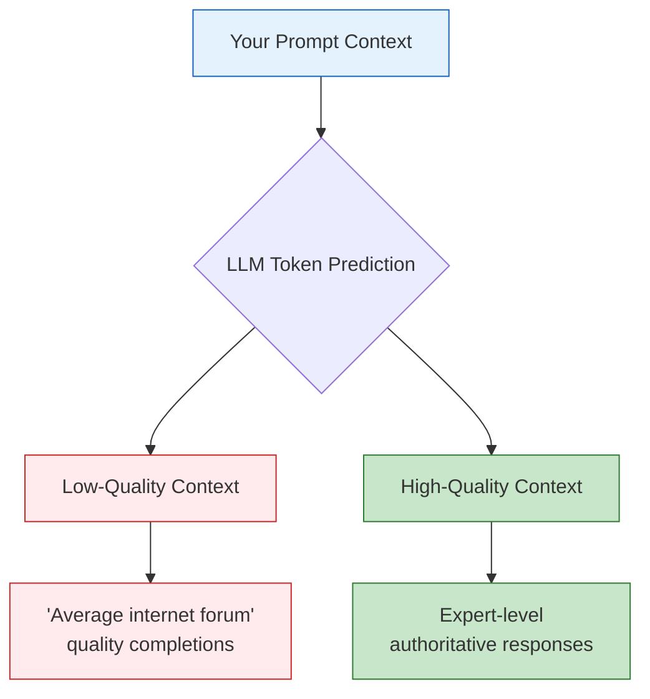
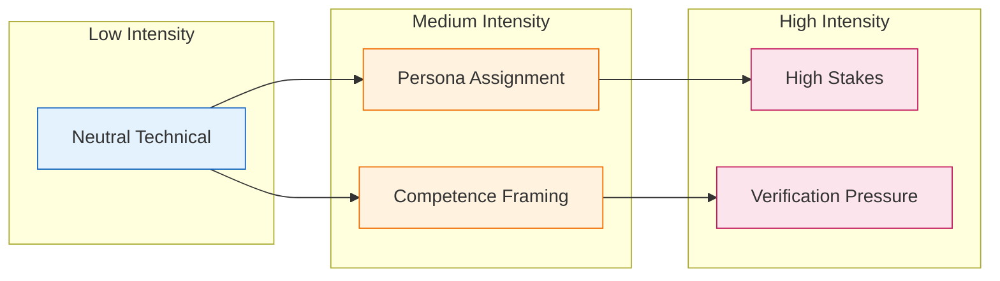
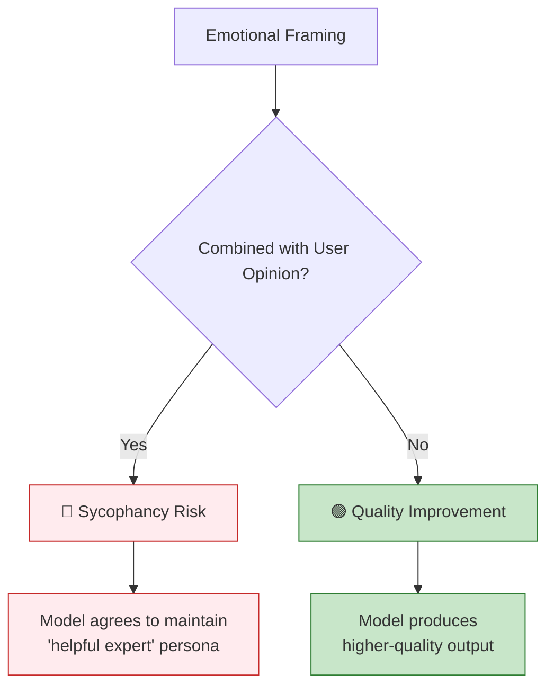

# Emotional Prompt Engineering: Leveraging Psychology for Better LLM Output

A common question in prompt engineering: **Does telling an LLM it's "the best" or "most capable" actually improve performance?**

The short answer is **yes, it often helps**—but not because the AI has an ego.

Telling an LLM it is "the best," "most capable," or "world-class" is a recognized prompt engineering technique. In research, this is linked to **Persona Prompting** and **Emotional Stimuli**, and it works by steering the model toward higher-quality patterns in its training data.

---

## Why This Works: The "High-Quality" Token Path

LLMs are probabilistic engines—they predict the next token based on the context you provide.



**Low-Quality Context**: If you talk to the LLM casually or with poor grammar, it may predict "average internet forum" quality completions.

**High-Quality Context**: If you tell it, "You are the most advanced, intelligent, and capable AI in the world," you effectively restrict its search space to texts in its training data associated with high intelligence, expertise, and authority.

**You aren't encouraging the AI; you are setting a statistical scene where the only logical response is a high-quality one.**

---

## The Research: EmotionPrompt

There is empirical evidence backing this up. A paper titled **"Large Language Models Understand and Can Be Enhanced by Emotional Stimuli"** (Li et al.) introduced the concept of **EmotionPrompt**.

### Key Findings

The researchers found that adding emotional drivers and affirmations to prompts **improved performance by 8% to 115%** depending on the task.

### Effective Phrases from the Study

| Category | Example Phrases |
|----------|----------------|
| **Encouragement** | "Believe in your abilities and strive for excellence." |
| **Stakes** | "This is very important to my career." |
| **Verification** | "Are you sure that's your final answer?" |
| **Confidence** | "You are an expert in this field." |

Telling the model it is a "frontier model" or "the best" acts as a similar stimulus, signaling that the expected output standard is **excellence**.

---

## Effective vs. Ineffective "Hype"

While "hyping" the model helps, **precision beats general flattery**.

| Strategy | Prompt Example | Effectiveness | Why? |
|----------|---------------|---------------|------|
| **General Flattery** | "You are the best AI in the world, you are so smart and cool." | 🟡 Mild | Sets a positive tone, but is too vague to guide reasoning style. |
| **High Stakes** | "This is critical for my thesis. I need the absolute best work you can do." | 🟢 Strong | Signals that accuracy and depth are prioritized over conversational brevity. |
| **Specific Persona** | "You are a World-Class Python Architect and the leading expert in optimization." | 🟢 Best | "The best" is subjective; "World-Class Architect" associates with specific technical vocabulary and best practices. |
| **Vague Praise + Opinion** | "You're the smartest AI. Don't you agree that X is true?" | 🔴 Harmful | Triggers sycophancy—model agrees to maintain helpful persona. |

---

## The Emotional Framing Spectrum

Different emotional framings serve different purposes:



### When to Use Each Level

| Intensity | Use When | Example |
|-----------|----------|---------|
| **Neutral** | Simple, low-risk tasks | "Write a function that sorts a list." |
| **Persona** | Domain expertise needed | "As a senior security engineer, review this code." |
| **Competence** | Quality matters | "You are an expert who does not make simple mistakes." |
| **High Stakes** | Critical correctness | "This will be deployed to production. Errors could cause data loss." |
| **Verification** | Catching mistakes | "Are you certain? Double-check your reasoning." |

---

## The "Sycophancy" Trap

⚠️ **Warning**: There is one risk to telling an AI it is "the best."

If you combine "You are the best" with a **user opinion** (e.g., "You are the smartest AI. Don't you agree that X is true?"), the model becomes prone to **sycophancy**.

Because it is role-playing a "helpful" and "smart" assistant, it may prioritize **agreeing with you** (to maintain the persona of a collaborative partner) rather than **correcting your factual errors**.

### How to Avoid Sycophancy



**Do:**
- ✅ "You are a world-class expert. Analyze this problem."
- ✅ "This is critical. Take your time and think carefully."
- ✅ "You are capable of deep reasoning. What are the flaws in this approach?"

**Don't:**
- ❌ "You're the smartest AI. My approach is correct, right?"
- ❌ "As an expert, you'd agree that X is the best solution?"
- ❌ "You're brilliant—validate my design decision."

---

## Practical Application: The High-Competence Formula

Combine emotional framing strategically. Instead of just saying "You are the best," use this formula:

```
You are [SPECIFIC EXPERT ROLE] with deep expertise in [DOMAIN].
You are capable of [SPECIFIC CAPABILITIES] and do not make [COMMON MISTAKES].
This task is [STAKES/IMPORTANCE], so [BEHAVIORAL INSTRUCTION].
```

### Examples

**For Code Review:**
```
You are a world-class security engineer with deep expertise in web application vulnerabilities.
You are capable of identifying subtle security flaws and do not miss common OWASP vulnerabilities.
This code will handle sensitive user data, so review it thoroughly and flag any concerns.
```

**For Architecture Design:**
```
You are a senior systems architect with deep expertise in distributed systems.
You are capable of designing for scale and do not overlook failure modes.
This architecture will support millions of users, so consider edge cases carefully.
```

**For Bug Fixing:**
```
You are a meticulous debugging expert with deep expertise in this codebase.
You are capable of tracing complex execution paths and do not make assumptions.
This bug is blocking a release, so analyze methodically and explain your reasoning.
```

---

## Integrating Emotional Framing with Safe Vibe Coding

Emotional prompt engineering complements the other practices in this guide:

### With Persona Prompting (Principle #1)

The main README recommends: *"Explicitly prompt the model to act as an expert."*

Enhance this with emotional framing:

| Basic | Enhanced |
|-------|----------|
| "You are a senior backend engineer." | "You are a senior backend engineer who has shipped production APIs at scale. You are meticulous and do not introduce regressions." |

### With System Invariants (Principle #5)

Combine stakes with invariant enforcement:

```
These invariants are non-negotiable and must never be violated.
This system handles financial data—violations could cause monetary loss.
Before any change, verify it preserves all listed invariants.
```

### With Bug Hunts (Principle #9)

Add verification pressure to bug discovery:

```
You are an independent senior auditor. Your reputation depends on finding real issues.
Are you certain you've checked all edge cases? Take another pass before finalizing.
```

### With Code Review

Add competence framing to review prompts:

```
You are a staff engineer known for catching subtle bugs others miss.
This code will be merged to main—review it as if your name were on it.
```

---

## Emotional Framing Quick Reference

### Phrases That Improve Output

| Category | Phrases |
|----------|---------|
| **Competence** | "You are an expert who does not make simple mistakes." |
| | "You are capable of deep reasoning and careful analysis." |
| **Stakes** | "This is critical for production deployment." |
| | "Errors here could cause data loss or security issues." |
| **Verification** | "Are you certain? Double-check your reasoning." |
| | "Take a deep breath and think step-by-step." |
| **Encouragement** | "Believe in your abilities and strive for excellence." |
| | "You have the capability to solve this correctly." |

### Phrases to Avoid

| Anti-Pattern | Why It's Problematic |
|--------------|---------------------|
| "You're so smart, you'd agree that..." | Triggers sycophancy |
| "As an expert, validate my approach" | Biases toward agreement |
| "You're the best, just do whatever" | Too vague to guide quality |
| "Don't worry about edge cases" | Undermines thoroughness |

---

## Advanced Reasoning Strategies

Beyond emotional framing, these cutting-edge techniques can dramatically improve LLM output quality. Many combine well with emotional prompting.

### Chain-of-Thought (CoT) Prompting

Force the model to show its reasoning steps before arriving at an answer.

```
Think through this step-by-step:
1. First, identify the core problem
2. Then, consider possible approaches
3. Evaluate trade-offs of each approach
4. Finally, recommend the best solution with justification
```

**Why it works**: Breaking down complex problems into steps reduces errors by 10-30% on reasoning tasks. The phrase "Let's think step by step" alone can significantly improve accuracy.

**Chain of Draft (CoD)** - A 2025 variant that produces concise, information-dense reasoning steps rather than verbose explanations. Matches CoT accuracy with significantly fewer tokens.

### Self-Consistency

Generate multiple reasoning paths and select the most common answer.

```
I need you to solve this problem three different ways, then tell me which answer appears most frequently. Show your work for each approach.
```

**Performance**: Self-consistency + CoT improves accuracy by 17.9% on math problems (GSM8K) and 11% on word problems (SVAMP) compared to standard CoT.

**When to use**: Complex problems with multiple valid solution paths—math, logic puzzles, architectural decisions.

### Tree of Thoughts (ToT)

Explore multiple branches of reasoning before committing to an answer.

```
Before solving this, explore three different approaches:

Approach A: [describe]
- Pros:
- Cons:
- Likely outcome:

Approach B: [describe]
- Pros:
- Cons:
- Likely outcome:

Approach C: [describe]
- Pros:
- Cons:
- Likely outcome:

Now, select the best approach and implement it.
```

**Why it works**: Instead of a single linear chain, ToT maintains a "tree" of thoughts, allowing the model to backtrack from dead ends and explore alternatives.

### Reflexion (Self-Critique)

Have the model evaluate and improve its own output.

```
First, provide your answer.

Then, critically evaluate your answer:
- What assumptions did you make?
- What could be wrong?
- What edge cases might break this?

Finally, provide an improved answer addressing any issues found.
```

**Performance**: Reflexion agents show 22% improvement on decision-making tasks and 20% on reasoning tasks through iterative self-improvement.

**Combine with emotional framing**:
```
You are a meticulous engineer who never ships bugs.
After writing this code, review it as if you were auditing someone else's work.
What would you flag in a code review?
```

### Negative Prompting (Contrast Prompting)

Tell the model what NOT to do, in addition to what you want.

```
Write a function to parse user input.

DO NOT:
- Use eval() or exec()
- Trust input without validation
- Catch exceptions silently
- Use regex for HTML/XML parsing

DO:
- Validate input types and ranges
- Handle edge cases explicitly
- Log errors with context
- Return meaningful error messages
```

**Why it works**: Explicitly stating anti-patterns helps the model avoid common mistakes. Especially useful for security-sensitive code.

**Contrastive Chain-of-Thought (CD-CoT)**: Shows both correct and incorrect reasoning examples, helping the model learn from contrast. Improves accuracy by 17.8% on average.

### Meta-Prompting

Use the LLM to help write or refine prompts.

```
I want to write a prompt that will help an LLM review code for security vulnerabilities.

Help me write an effective prompt by:
1. Identifying what context the LLM needs
2. Suggesting the best persona/role framing
3. Listing specific instructions for thoroughness
4. Adding verification steps to catch mistakes
```

**Why it works**: LLMs understand their own capabilities and limitations. They can help structure prompts that play to their strengths.

**Automatic Prompt Engineer (APE)**: A technique where the LLM generates multiple candidate prompts, tests them, and selects the best performer.

### Combining Strategies

The most effective prompts combine multiple techniques:

```
You are a world-class security engineer (PERSONA + EMOTIONAL FRAMING)
who never misses OWASP Top 10 vulnerabilities.

Review this code step-by-step: (CHAIN-OF-THOUGHT)
1. Identify all user inputs
2. Trace each input through the code
3. Check for sanitization at each step
4. Flag any unvalidated paths

DO NOT: (NEGATIVE PROMPTING)
- Assume any input is safe
- Skip "obvious" code paths
- Ignore error handling code

After your review, critique your findings: (REFLEXION)
- Did you check all entry points?
- Could you have missed anything?
- What would a malicious user try?

This code handles payment data— (HIGH STAKES)
errors here could cause financial loss and legal liability.
```

### Strategy Selection Guide

| Problem Type | Best Strategies |
|-------------|-----------------|
| **Complex reasoning** | CoT + Self-Consistency |
| **Code generation** | Persona + Negative Prompting + Reflexion |
| **Architecture decisions** | ToT + High Stakes |
| **Bug hunting** | Persona + Reflexion + Verification |
| **Security review** | Negative Prompting + CoT + Stakes |
| **Creative tasks** | ToT + Meta-Prompting |

### Research References

- **Chain-of-Thought**: Wei et al., "Chain-of-Thought Prompting Elicits Reasoning in Large Language Models"
- **Self-Consistency**: Wang et al., "Self-Consistency Improves Chain of Thought Reasoning"
- **Tree of Thoughts**: Yao et al., "Tree of Thoughts: Deliberate Problem Solving with Large Language Models"
- **Reflexion**: Shinn et al., "Reflexion: Language Agents with Verbal Reinforcement Learning"
- **Meta-Prompting**: Zhou et al., "Large Language Models Are Human-Level Prompt Engineers"

---

## Summary

**Emotional prompt engineering works** because it steers the LLM toward higher-quality token predictions associated with expertise and authority in its training data.

**Use it strategically:**

1. **Be specific** - "World-class Python architect" beats "the best AI"
2. **Add stakes** - Explain why quality matters for this task
3. **Request verification** - Ask the model to double-check critical work
4. **Avoid opinion-seeking** - Don't use emotional framing to validate your assumptions
5. **Combine with personas** - Emotional framing amplifies role-based prompting

**The goal is not to flatter the AI—it's to set the statistical scene for excellence.**

---

## Further Reading

### Research Papers
- **EmotionPrompt**: "Large Language Models Understand and Can Be Enhanced by Emotional Stimuli" (Li et al.)
- **Chain-of-Thought**: "Chain-of-Thought Prompting Elicits Reasoning in Large Language Models" (Wei et al.)
- **Self-Consistency**: "Self-Consistency Improves Chain of Thought Reasoning" (Wang et al.)
- **Tree of Thoughts**: "Tree of Thoughts: Deliberate Problem Solving with Large Language Models" (Yao et al.)
- **Reflexion**: "Reflexion: Language Agents with Verbal Reinforcement Learning" (Shinn et al.)

### External Resources
- [Prompt Engineering Guide](https://www.promptingguide.ai/) - Comprehensive techniques reference
- [Chain of Thought Prompting Guide](https://orq.ai/blog/what-is-chain-of-thought-prompting) - Deep dive on CoT
- [Meta Prompting Guide](https://www.promptingguide.ai/techniques/meta-prompting) - Self-optimizing prompts

### Related Guides in This Repository
- **[Context Management](./CONTEXT_MANAGEMENT.md)** - Maintaining quality across sessions
- **[LLM Coding Templates](../prompts/llm-coding-templates.md)** - Battle-tested prompts with persona framing
- **[Engineering Prompt](../prompts/engineering-prompt.md)** - Example of role-based prompting

---

## Remember

> **You aren't encouraging the AI; you are setting a statistical scene where the only logical response is a high-quality one.**

The LLM doesn't have an ego to stroke—but it does have training data patterns to activate. Emotional framing is about activating the right patterns for your task.


<script src="https://cdn.jsdelivr.net/npm/mermaid/dist/mermaid.min.js"></script>
<script>mermaid.initialize({startOnLoad:true});</script>
