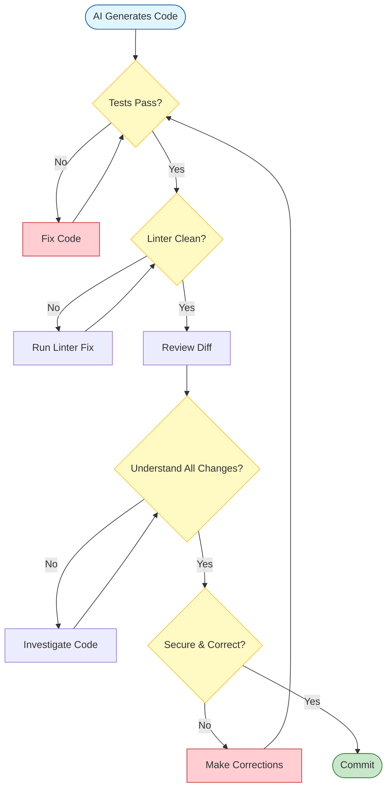

# Version Control Best Practices for AI-Assisted Development

AI-generated code requires careful version control practices. Because code appears quickly, it's tempting to commit large batches without proper review. This document outlines how to use git effectively when working with LLMs.

---

## Core Principles

1. **Commit only code you've reviewed**
2. **Make atomic commits** (one logical change per commit)
3. **Write meaningful commit messages**
4. **Review diffs before committing**
5. **Test before committing**

---

## The Commit Workflow



### Before Committing

#### 1. Run Tests

```bash
# All tests must pass
npm test
# or
pytest
# or
cargo test
```

**Never commit broken code.** Even if "it works locally," tests must pass.

#### 2. Run Linters

```bash
# Fix style issues automatically
npm run lint --fix
# or
black .
pylint src/
# or
cargo fmt
cargo clippy
```

**Fix all linter errors before committing.**

#### 3. Review the Diff

```bash
# See what's changed
git diff

# Or use a visual diff tool
git difftool
```

**Read every line.** Ask yourself:
- Do I understand what this does?
- Is this necessary?
- Are there any obvious bugs?
- Is it secure?

### The Commit

#### Atomic Commits

**Good**: One logical change per commit

```bash
✅ git add src/auth/oauth.ts tests/auth/oauth.test.ts
   git commit -m "Add OAuth authentication support"

✅ git add src/middleware/logging.ts
   git commit -m "Fix logging middleware error handling"
```

**Bad**: Multiple unrelated changes

```bash
❌ git add .
   git commit -m "Various fixes and features"
   # This commit has: OAuth, logging fix, UI changes, refactoring
```

#### When to Commit

**Commit after**:
- ✅ Feature works (manually tested)
- ✅ Tests pass
- ✅ Code reviewed
- ✅ No linter errors
- ✅ Diff reviewed

**Don't commit**:
- ❌ "Just to save progress" (use `git stash` instead)
- ❌ Broken code (even temporarily)
- ❌ Unreviewed AI output
- ❌ Failed tests
- ❌ Work in progress (use feature branches)

### Commit Messages

**Format**: Follow Conventional Commits or your team's standard

```bash
# Good commit messages
✅ "Add user authentication with OAuth 2.0"
✅ "Fix null pointer exception in payment processing"
✅ "Refactor user repository for better testability"
✅ "Update API docs for /users endpoint"

# Bad commit messages
❌ "fix"
❌ "changes"
❌ "WIP"
❌ "asdf"
❌ "AI generated code"
```

**Template for AI-assisted work**:

```bash
<type>: <brief description>

<what changed and why>

AI-assisted: <prompt or approach used>
Reviewed: <what you verified>
```

**Example**:

```bash
feat: Add OAuth authentication

Implemented OAuth 2.0 support for Google and GitHub login.
Users can now authenticate using social accounts in addition
to email/password.

AI-assisted: Used architecture-aware-feature prompt
Reviewed: Security, error handling, test coverage
Tests: Added integration tests for OAuth flow
```

---

## Branching Strategy

### Branch Types

**Feature branches**: For new features or changes

```bash
# Create feature branch
git checkout -b feature/oauth-auth

# Work on feature (AI-assisted)
# Commit incrementally
# When done, merge to main
```

**Experimental branches**: For AI exploration

```bash
# Try new approach
git checkout -b experiment/alternative-auth

# Let AI explore
# If it works, clean up and merge
# If it fails, delete branch
```

**Bug fix branches**: For fixes

```bash
git checkout -b fix/login-validation
```

### Working with Feature Branches

**Creating a branch**:

```bash
# Always branch from updated main
git checkout main
git pull
git checkout -b feature/new-feature
```

**During development**:

```bash
# Commit frequently (but only working code)
git add <files>
git commit -m "Implement first part of feature"

# Push to remote periodically
git push -u origin feature/new-feature
```

**Before merging**:

```bash
# Update from main
git checkout main
git pull
git checkout feature/new-feature
git rebase main  # or merge main

# Resolve conflicts
# Run all tests
# Review all changes

# Merge to main
git checkout main
git merge feature/new-feature
git push
```

---

## Multi-Agent Git Safety

### The Problem: Parallel Agents, Shared Working Directory

When you run multiple Claude Code tabs (or any coding agents) against the same repository, each agent can create, modify, and delete files — but none of them know what the others are doing. This creates a predictable and devastating failure mode:

```
Tab 1: Creates 9 mock data files in src/lib/mock/data/
Tab 2: Creates components that import those mock data files
Tab 3: You ask it to "commit and push to main"
Tab 3: Runs git add on the files it knows about → misses Tab 1's files
Tab 3: Commits and pushes
You: Pull from main on another machine → mock data files don't exist
The components from Tab 2 are broken. Tab 1's work is gone.
```

This is **not** a git problem. Git is working correctly. The problem is that the committing agent doesn't know about files created by other agents because it has no record of them in its conversation context.

### Why This Happens

1. **Agents track their own changes, not the working directory.** When you tell an agent to "commit and push," it commits what *it* knows about — the files it created or modified. It doesn't run `git status` to discover files from other sessions (or if it does, it may not recognize them as important).

2. **`git add <specific files>` is the safe default for single-agent work** — it prevents accidentally staging secrets, build artifacts, or scratch files. But with multiple agents, it becomes the mechanism for losing work.

3. **No agent has the full picture.** Each tab's context window contains only its own conversation. Tab 3 has no idea that Tab 1 created mock data files, so it has no reason to stage them.

### The Rules

#### Rule 1: Never ask one agent to commit another agent's work

The committing agent doesn't know what the other agents created, why, or whether it's ready. Instead:

```bash
# ❌ In Tab 3: "commit and push everything to main"
# Tab 3 will miss files it doesn't know about

# ✅ Stop all agents. Open a fresh terminal. Commit manually.
git status                    # See EVERYTHING in the working directory
git diff                      # Review all changes
git add -A                    # Stage everything (after reviewing)
git commit -m "..."
git push
```

If you're going to use an agent to commit, give it explicit instructions to discover all changes:

```
Before committing, run git status to find ALL untracked and modified files
in the entire repository — not just files you created. List every file
and confirm with me before staging.
```

#### Rule 2: Commit each agent's work from its own tab before moving on

When an agent finishes a unit of work, commit it immediately from that tab — while the agent still has full context of what it created.

```
Tab 1 finishes mock data → commit from Tab 1
Tab 2 finishes components → commit from Tab 2
Tab 3 finishes integration → commit from Tab 3
```

Each agent knows exactly what it created, so each commit is complete.

#### Rule 3: Use branches, not tabs-on-main

If you have multiple agents working in parallel, each should be on its own branch:

```bash
Tab 1: git checkout -b feature/mock-data
Tab 2: git checkout -b feature/dashboard-components
Tab 3: git checkout -b feature/integration
```

Merge them together when all are complete. This eliminates the "one agent commits and wipes another's work" problem entirely — because each branch is isolated.

**The problem with branches alone:** If all agents share the same directory, `git checkout` in one tab changes the files every other tab is working on. You can't have Tab 1 on `feature/mock-data` and Tab 2 on `feature/dashboard-components` in the same folder.

**Git worktrees solve this.** A worktree lets you check out a branch into a separate directory while sharing the same git history, commits, and remotes. Instead of one directory that switches between branches, you get multiple directories — each with its own branch and its own files:

```
~/my-project/                    ← main branch (original clone)
~/my-project-mock-data/          ← feature/mock-data branch
~/my-project-components/         ← feature/dashboard-components branch
```

All three directories share the same `.git` history. A commit made in any worktree is visible from all others. But the working files are completely isolated — agents in different worktrees can't step on each other.

**Setting up worktrees for parallel agents:**

```bash
# From your repo root
cd ~/my-project

# Create a worktree + new branch in one command (-b creates the branch)
git worktree add -b feature/mock-data ../my-project-mock-data
git worktree add -b feature/dashboard-components ../my-project-components

# Now point each agent tab at its own directory:
# Tab 1 → ~/my-project-mock-data/
# Tab 2 → ~/my-project-components/
# Tab 3 → ~/my-project/ (main)

# Each agent commits and pushes its branch independently. No conflicts.
```

**When all agents are done, merge the branches:**

```bash
cd ~/my-project
git merge feature/mock-data
git merge feature/dashboard-components
```

**Clean up when finished:**

```bash
git worktree remove ../my-project-mock-data
git worktree remove ../my-project-components
# See all active worktrees:
git worktree list
```

**Key things to know about worktrees:**
- Each branch can only be checked out in **one** worktree at a time (git enforces this)
- Worktrees are lightweight — they share git history, they don't duplicate it
- `git worktree list` shows all your active worktrees
- If you forget to clean up, `git worktree prune` removes stale entries

#### Rule 4: Run `git status` before AND after every push

Before pushing, check for unstaged files that shouldn't be lost:

```bash
git status
# Look for:
# - Untracked files that should be committed
# - Modified files not staged for commit
# - Files in directories you didn't create yourself
```

After pushing, verify the remote has everything:

```bash
git log --stat HEAD~1..HEAD  # What was actually pushed?
# Compare against what you expected to push
```

#### Rule 5: Never `git pull` or `git checkout` with uncommitted work

This is the most common way multi-agent work gets destroyed. Agent A creates files. You switch to main or pull from remote. Uncommitted files in tracked directories may be overwritten.

```bash
# ❌ Pull with uncommitted changes from other agents
git pull origin main  # May silently discard uncommitted work

# ✅ Stash first, always
git stash --include-untracked  # Saves everything, including new files
git pull origin main
git stash pop                  # Restore your work
```

### Recovery: When Work Is Already Lost

If files were created but never committed, and you've since pulled or checked out:

1. **Check `git stash list`** — you may have stashed them earlier
2. **Check your editor's local history** — VS Code and JetBrains keep local file history independent of git
3. **Check `/tmp` or OS-level recovery** — some systems keep recently deleted files
4. **Ask the agent that created them to recreate** — if the agent's tab is still open, it has the conversation context and can regenerate the files. This is the most reliable recovery path.
5. **Check `git reflog`** — if the files were ever committed (even in a commit that was later reset), they're recoverable

### CLAUDE.md Rule for Multi-Agent Safety

Add this to your project's CLAUDE.md to make agents aware of the risk:

```markdown
## Git Safety for Multi-Agent Sessions

Before committing:
1. Run `git status` to find ALL untracked and modified files, not just your own
2. List any files you didn't create and flag them to the user
3. Never run `git add .` or `git add -A` without first showing `git status` output
4. If you see untracked files you don't recognize, ask before committing

Before pulling or checking out:
1. Run `git status` to check for uncommitted work
2. If there are untracked or modified files, stash them first
3. Never discard changes you didn't create
```

---

## Reviewing AI-Generated Diffs

### Use Visual Diff Tools

```bash
# Better than command-line diff for large changes
git difftool

# Or use your editor's git integration
code .  # VS Code
```

### What to Look For

**Added lines**:
- Is this code necessary?
- Is it correct?
- Is it secure?

**Deleted lines**:
- Why was this removed?
- Is it safe to delete?
- Are there dependencies on this code?

**Modified lines**:
- What changed and why?
- Is the new version better?
- Are there side effects?

### Red Flags in Diffs

🚩 **Large blocks of commented code** - Delete it or uncomment it

🚩 **TODO/FIXME comments** - Address before committing

🚩 **Hardcoded secrets** - Never commit secrets

🚩 **Massive files** - Should this be split?

🚩 **Unrelated changes** - Should be separate commits

🚩 **Generated files** - Should be in .gitignore

---

## Handling AI Experimentation

### Stashing Experiments

```bash
# AI generated something you want to save but not commit
git stash push -m "OAuth alternative approach"

# Work on something else

# Later, restore
git stash list
git stash apply stash@{0}
```

### Branching for Experiments

```bash
# Try AI approach 1
git checkout -b experiment/approach-1
# ... AI generates code ...
# Commit the experiment
git commit -am "Experiment: Using JWT for auth"

# Try AI approach 2
git checkout main
git checkout -b experiment/approach-2
# ... AI generates different code ...
git commit -am "Experiment: Using sessions for auth"

# Compare approaches
git diff experiment/approach-1 experiment/approach-2

# Choose winner
git checkout main
git merge experiment/approach-1  # Keep this approach
git branch -D experiment/approach-2  # Delete failed experiment
```

---

## Commit Frequency

### Commit After Each Working Unit

**Too infrequent** (bad):
```bash
❌ Work for 6 hours
   Generate 50 files with AI
   Commit everything at once
   # Impossible to review, hard to revert
```

**Good frequency**:
```bash
✅ Implement OAuth controller (30 min) → commit
✅ Add OAuth middleware (20 min) → commit
✅ Update user model (15 min) → commit
✅ Add tests (30 min) → commit
```

**Too frequent** (also bad):
```bash
❌ Fix typo → commit
   Add semicolon → commit
   Rename variable → commit
   # Cluttered history
```

### The Test: Can You Revert This Commit?

**Good commit**: Reverting it removes one feature cleanly

**Bad commit**: Reverting it breaks multiple things or only partially removes a feature

---

## Handling Failed AI Attempts

### Option 1: Discard and Start Over

```bash
# AI generated broken code
git status  # See what changed
git restore .  # Discard all changes
# Start fresh with better prompt
```

### Option 2: Stash and Retry

```bash
# Some of this might be useful
git stash push -m "Failed OAuth attempt"
# Try again
# If new attempt works, commit it
# Old stash can be deleted later
git stash drop
```

### Option 3: Cherry-Pick Good Parts

```bash
# AI mixed good and bad code
git add src/auth/oauth.ts  # Good file
git commit -m "Add OAuth controller"

git restore src/middleware/  # Bad files
# Ask AI to regenerate just the middleware
```

---

## .gitignore for AI Projects

**Essential ignores**:

```gitignore
# Dependencies
node_modules/
venv/
.venv/

# Build outputs
dist/
build/
*.pyc
__pycache__/

# Environment files (NEVER commit secrets)
.env
.env.local
.env.*.local

# Editor files
.vscode/
.idea/
*.swp

# OS files
.DS_Store
Thumbs.db

# Logs
*.log
logs/

# Test coverage
coverage/
.coverage

# AI-specific
.ai_session_logs/  # If you keep logs
scratch/  # Experimental AI work
```

---

## Commit Message Templates

### For AI-Generated Features

```bash
feat: <feature name>

<description of what it does>

Implementation details:
- <key technical decision 1>
- <key technical decision 2>

AI-assisted: <which prompt used>
Human review:
- [x] Functionality tested
- [x] Security reviewed
- [x] Tests passing
- [x] Architecture aligned
```

### For AI-Assisted Refactoring

```bash
refactor: <what was refactored>

Refactored to <improvement achieved>

Changes:
- <specific change 1>
- <specific change 2>

AI-assisted: Used refactor-for-clarity prompt
Verified: All tests pass, behavior unchanged
```

### For AI-Assisted Bug Fixes

```bash
fix: <brief description of bug>

Fixed <detailed description>

Root cause: <why the bug existed>
Solution: <what was changed>

AI-assisted: Used bug-fixing prompt
Reviewed: <what you verified>
Tests: <new/updated tests>
```

---

## Pre-Commit Hooks

**Automate checks before commits**:

```bash
# .git/hooks/pre-commit
#!/bin/bash

# Run tests
npm test || exit 1

# Run linter
npm run lint || exit 1

# Check for secrets
if git diff --cached | grep -i "api_key\|secret\|password\s*="; then
    echo "⚠️  Possible secret detected! Review before committing."
    exit 1
fi

echo "✅ Pre-commit checks passed"
```

Make executable:
```bash
chmod +x .git/hooks/pre-commit
```

---

## Reviewing Your Own Commits

### Before Pushing

```bash
# Review commits before pushing
git log -p origin/main..HEAD

# Check the summary
git log --oneline origin/main..HEAD
```

**Ask yourself**:
- Would I understand these changes in 6 months?
- Is anything missing tests?
- Did I commit something that shouldn't be there?
- Are commit messages clear?

### After Pushing (PR Review)

**Review your own PR first**:
- Read the diff on GitHub/GitLab
- Check for issues you missed locally
- Update PR description
- Add comments on complex parts

---

## Collaboration Workflow

### Working with Others on AI-Assisted Code

**Pull Request Description Template**:

```markdown
## Summary
<What this PR does>

## AI Assistance
- Prompts used: <which prompts>
- Human review: <what you verified>
- Testing: <what was tested>

## Changes
- <file 1>: <what changed>
- <file 2>: <what changed>

## Security Review
- [ ] Input validation present
- [ ] No SQL injection risks
- [ ] No XSS vulnerabilities
- [ ] Auth/authz correct

## Testing
- [ ] Unit tests added/updated
- [ ] Integration tests passing
- [ ] Manually tested

## Checklist
- [ ] Code reviewed line-by-line
- [ ] Tests passing
- [ ] Linter passing
- [ ] Invariants maintained
- [ ] Architecture aligned
```

---

## Emergency Procedures

### Accidentally Committed Secrets

```bash
# DO NOT just delete in next commit - it's in history!

# Option 1: Rewrite history (if not pushed)
git reset HEAD~1  # Undo commit
# Remove secrets
git add .
git commit -m "..."

# Option 2: If already pushed - rotate the secrets immediately
# Then: git filter-branch or BFG Repo-Cleaner to remove from history
```

**Prevention**: Use pre-commit hooks to detect secrets.

### Accidentally Committed Broken Code

```bash
# If not pushed
git reset HEAD~1  # Undo commit
# Fix the code
git add .
git commit -m "..."

# If already pushed but no one pulled
git push --force  # Use with caution!

# If others have pulled - do NOT rewrite history
# Fix in a new commit instead
```

---

## Best Practices Summary

1. **Test before committing** - All tests must pass
2. **Review before committing** - Read every line
3. **Atomic commits** - One logical change per commit
4. **Meaningful messages** - Future you will thank you
5. **Branch for experiments** - Keep main stable
6. **Never commit secrets** - Use .env files
7. **Use pre-commit hooks** - Automate quality checks
8. **Review your own PRs** - Catch issues before others
9. **Small, frequent commits** - Easier to review and revert
10. **Discard bad attempts** - Don't commit everything AI generates

---

## Remember

**Git is your safety net.**

With AI generating code quickly, version control becomes even more critical:
- You can experiment freely (branches are cheap)
- You can revert mistakes (commits are checkpoints)
- You can track what changed (diffs show AI additions)
- You can review incrementally (small commits are reviewable)

**Use git as a tool to work confidently with AI.**

**When in doubt, commit working code frequently. You can always squash commits later.**
