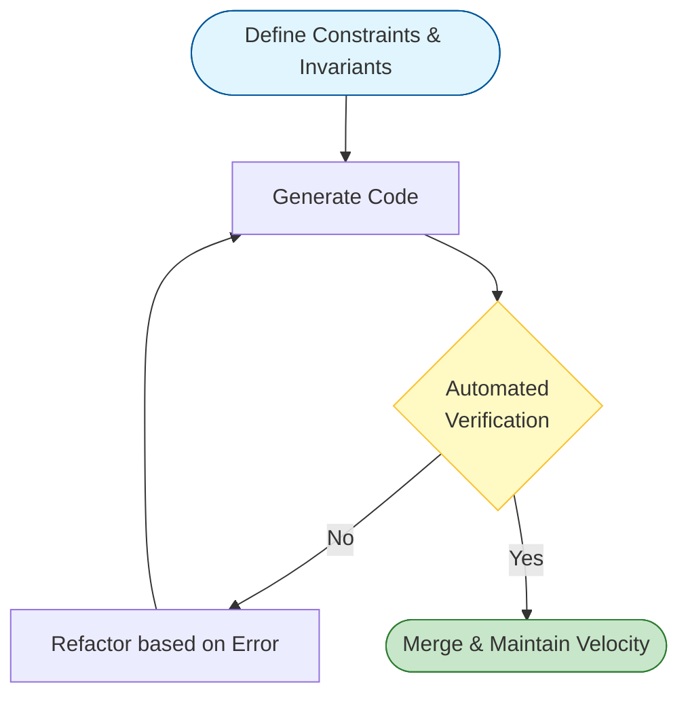

# Vibe Coding with LLMs
{: .fs-9 }

A practical guide to building real software with LLMs while maintaining correctness, stability, and long-term maintainability.
{: .fs-6 .fw-300 }

[Get Started](#getting-started){: .btn .btn-primary .fs-5 .mb-4 .mb-md-0 .mr-2 }
[View on GitHub](https://github.com/Frostbite1536/Safe-Vibe-Coding){: .btn .fs-5 .mb-4 .mb-md-0 }

---

## Core Philosophy

Vibe coding works because it replaces "trusting the model" with **systems that enforce correctness**. You move fast without breaking things—not because the LLM is perfect, but because your process is.

{: .highlight }
> **Treat the LLM as a junior engineer with infinite stamina**: fast, tireless, and helpful—but lacking long-term judgment unless you supply it.

Your job is to provide:
- **Constraints** - Define what's allowed and what's not
- **Invariants** - Rules that must always hold
- **Tests** - Automated verification of correctness
- **Clear expectations** - Explicit requirements and conventions

---

## Getting Started

### New to Claude Code?

Start with the comprehensive setup guide:

[Claude Code Setup Guide]({{ site.baseurl }}/docs/BEGINNER_SETUP){: .btn .btn-blue }

Covers terminal setup, running multiple Claudes, Plan mode, CLAUDE.md, slash commands, hooks, and more.

### Essential Reading

| Guide | What You'll Learn |
|:------|:------------------|
| [Quick Reference Checklist]({{ site.baseurl }}/CHECKLIST) | Print-friendly checklist for daily use |
| [Anti-Patterns & Warning Signs]({{ site.baseurl }}/docs/ANTI_PATTERNS) | When AI development goes wrong |
| [Audit Findings & Lessons]({{ site.baseurl }}/docs/AUDIT_FINDINGS) | Real security audit of AI-generated code |
| [Automation & Testing]({{ site.baseurl }}/docs/AUTOMATION_TESTING) | CI/CD, hooks, and verification loops |
| [Context Management]({{ site.baseurl }}/docs/CONTEXT_MANAGEMENT) | Managing LLM sessions effectively |
| [Code Review for AI]({{ site.baseurl }}/docs/CODE_REVIEW_AI) | Reviewing AI-generated code |
| [Setting Up AI Code Review]({{ site.baseurl }}/docs/CODE_REVIEW_SETUP) | Tutorial: zero to automated PR reviews |
| [Version Control]({{ site.baseurl }}/docs/VERSION_CONTROL) | Git workflow for AI development |
| [MCP Tool Grouping]({{ site.baseurl }}/mcp-tool-grouping) | Scaling MCP servers beyond 20 tools |
| [Plan-Driven Development]({{ site.baseurl }}/plan-driven-development) | Structured planning workflow for coding agents |
| [Dependency Safety]({{ site.baseurl }}/dependency-safety) | Evaluating and managing AI-suggested packages |
| [Refactoring with AI]({{ site.baseurl }}/refactoring-with-ai) | Changing code safely with AI assistance |

---

## The Workflow

### 1. Start with a Product Conversation
Begin by talking to the LLM about **what** you want to build, not **how** yet. Describe the problem, users, and environment.

### 2. Co-Design the Prompt
Ask the LLM to help refine requirements before implementation. Identify missing constraints and trade-offs.

### 3. Produce a Roadmap
Generate phases with clear goals, features, and exclusions. Phases reduce scope creep.

### 4. Create Architecture Documents
Generate architecture and README docs early. These anchor consistency across sessions.

### 5. Define Invariants
Create non-negotiable rules that must always hold. Reference before any implementation.

### 6. Add Tests Immediately
Introduce tests as soon as real code appears. **Tests are gates, not optional feedback.**

### 7. Optimize for Boring Code
Tell the LLM explicitly: boring, predictable, production-grade solutions. Creativity is opt-in.

### 8. Favor Modularity
Keep files under ~1,500 lines. Smaller modules improve correctness and AI comprehension.

### 9. Run Bug Hunts
Regularly ask the LLM to review changes, check edge cases, find regressions, and **audit data at component boundaries** — where AI code most often breaks.

### 10. Give Claude Verification
**The most important pattern**: Give Claude a way to verify its work. This 2-3x the quality of output.

    
---

## Quick Links

### Templates
- [Architecture Template]({{ site.baseurl }}/docs/templates/ARCHITECTURE)
- [Invariants Template]({{ site.baseurl }}/docs/templates/INVARIANTS)
- [Roadmap Template]({{ site.baseurl }}/docs/templates/ROADMAP)
- [Project README Template]({{ site.baseurl }}/docs/templates/PROJECT_README)

### Prompts Library
- [Engineering Prompt]({{ site.baseurl }}/prompts/engineering-prompt)
- [Bug Hunt (General)]({{ site.baseurl }}/prompts/bug-hunt)
- [Bug Hunt (Backend)]({{ site.baseurl }}/prompts/backend-bug-hunt)
- [Bug Hunt (Frontend)]({{ site.baseurl }}/prompts/frontend-bug-hunt)
- [Bug Fixing]({{ site.baseurl }}/prompts/bug-fixing)
- [Performance Review]({{ site.baseurl }}/prompts/performance-review)

---

## Why This Works

Traditional software development emphasizes careful upfront planning because writing code is expensive. With LLMs, code generation is cheap—but **maintaining correctness is still hard**.

This workflow inverts the traditional approach:
- Spend time on constraints, tests, and documentation
- Let the LLM handle the tedious implementation
- Use automated checks to catch drift

The result: **velocity without chaos.**

---

## Contributing

This guide is a living document. If you've found patterns that work (or anti-patterns that don't), please contribute:

1. Share your templates in `/docs/templates`
2. Add useful prompts to `/prompts`
3. Document lessons learned

---

{: .note }
This guide is released into the public domain. Use it however helps you build better software.

